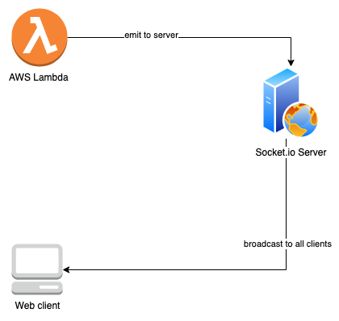
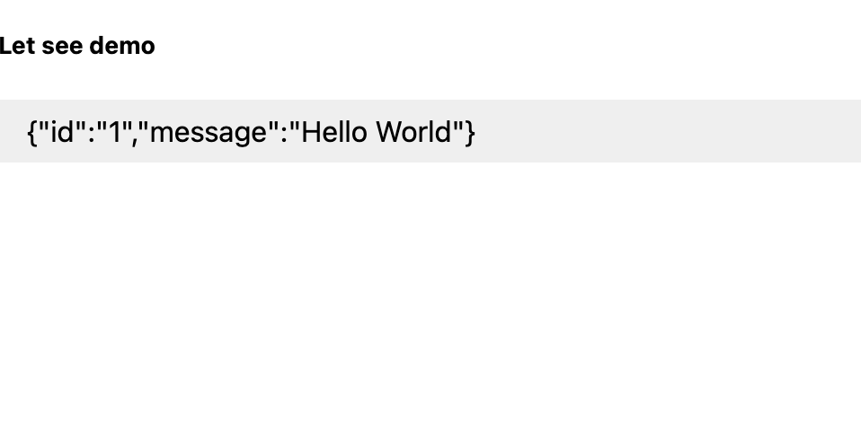

# cdk-socketio-lambda

This is P.O.C for use case `emit socket.io event from lambda`


## Deploy

```bash
$ ./deploy.sh
```

## Testing

Check file config.json you can see something like this

```json
{
  "SampleSocketIO": {
    "FunctionURL": "https://https://upv2sv2twvfdjv2qstdwjbteri0xstjp.lambda-url.ap-southeast-1.on.aws/",
    "WebSocketURL": "http://Sampl-ApiEc-PBBPBGLAPT4M-1065253365.ap-southeast-1.elb.amazonaws.com",
    "ApiEcsServiceLoadBalancerDNS44285D37": "Sampl-ApiEc-PBBPBGLAPT4M-1065253365.ap-southeast-1.elb.amazonaws.com",
    "ApiEcsServiceServiceURLC3AC31D2": "http://Sampl-ApiEc-PBBPBGLAPT4M-1065253365.ap-southeast-1.elb.amazonaws.com"
  }
}

```
1. Open ``WebSocketURL`` on browser
2. Open ``FunctionURL`` on browser and see some message appear on window of (1)



## Clean up
```bash
$ ./cdk-cleanup.sh